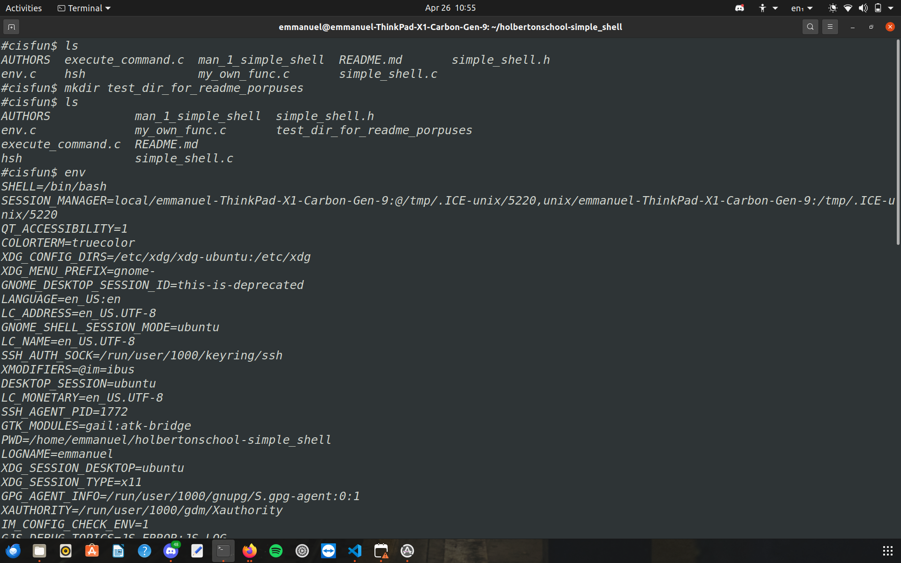

# holbertonschool-simple_shell

# C - Simple Shell Final Project

This project is a team effort by three individuals at Holberton Coding School. The main objective is to develop a simple UNIX command interpreter.

## Authors

- [Nissel Sanchez](https://github.com/niniisg)
- [Luis Marrero](https://github.com/Luismarrer)
- [Emmanuel Torres](https://github.com/Emahnny)

## Description of the project

In this projet we did a copy of a simple shell program which is a basic Unix shell that provides a command-line interface for users to execute commands. It reads commands from the standard
input and executes them.

# Learning Objectives

At the end of this project, you are expected to be able to explain to anyone, without the help of Google:

## General

- Who designed and implemented the original Unix operating system
- Who wrote the first version of the UNIX shell
- Who invented the B programming language (the direct predecessor to the C programming language)
- Who is Ken Thompson
- How does a shell work
- What is a pid and a ppid
- How to manipulate the environment of the current process
- What is the difference between a function and a system call
- How to create processes
- What are the three prototypes of main
- How does the shell use the PATH to find the programs
- How to execute another program with the execve system call
- How to suspend the execution of a process until one of its children terminates
- What is EOF / "end-of-file"?

## Requirements

### General

- Allowed editors: vi, vim, emacs
- All your files will be compiled on Ubuntu 20.04 LTS using gcc, using the options -Wall -Werror -Wextra -pedantic -std=gnu89
- All your files should end with a new line
- A README.md file, at the root of the folder of the project is mandatory
- Your code should use the Betty style. It will be checked using betty-style.pl and betty-doc.pl
- Your shell should not have any memory leaks
- No more than 5 functions per file
- All your header files should be include guarded
- Use system calls only when you need to (why?)

## Example Image

## Tasks

### 0. README, man, AUTHORS

**Mandatory**

- Write a README
- Write a man page for the shell.
- Include an AUTHORS file at the root of the repository, listing all contributors.

### 1. Betty would be proud

**Mandatory**

Write code that passes the Betty checks for beautiful code.

### 2. Simple shell 0.1

**Mandatory**

Write a UNIX command line interpreter.

Usage: `simple_shell`

### 3. Simple shell 0.2

**Mandatory**

Simple shell 0.1 plus:

- Handle command lines with arguments

### 4. Simple shell 0.3

**Mandatory**

Simple shell 0.2 plus:

- Handle the PATH
- Do not call fork if the command doesn’t exist

### 5. Simple shell 0.4

**Mandatory**

Simple shell 0.3 plus:

- Implement the `exit` built-in, which exits the shell
- Usage: `exit`
- No need to handle any argument to the built-in exit

### 6. Simple shell 1.0

**Mandatory**

Simple shell 0.4 plus:

- Implement the `env` built-in, which prints the current environment

